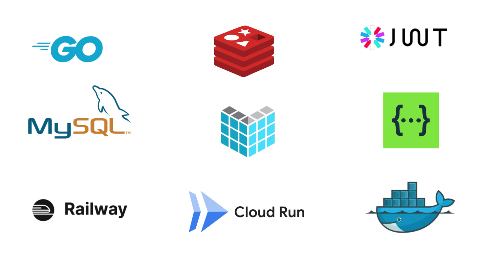
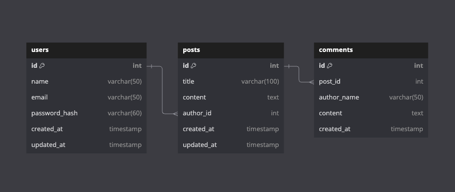

# Blog Takehome | RESTful API
Blog Takehome is my task assignment, and thank you so much for opportunity and ya! I am so excited about developing this assignment✨

Here are more details regarding the Blog Takehome that I created through the scaffold provided.

## Highlights
- REST API
- User Authentication
- Redis Implementation for caching
- User Logout
- API Docs with Swagger
- Deployment:
    - App to GCP (Cloud Run)
    - MySQL to Railway
    - Redis to Cloud Redis

## Tech Stacks

- Go: Programming language for developing app
- Echo: Go Framework for handle routes
- MySQL: SQL database to store data users, posts and comments
- JWT: Create token for authentication
- Redis: For caching data post detail
- Railway: Host for MySQL database
- Cloud Run: Host for App
- Docker: Containerization for running on local with Docker Compose and process deployment with Dockerfile
- Swagger: REST API Docs

## Database Designs

- users can have multiple posts
- post can have multiple comments

## API Endpoints
For try this API, you can try through this link:
https://blog-takehome-243802168923.asia-southeast2.run.app

**User Registration & Authentication**
- `POST /register` - Register a new user.
- `POST /login` - Login user and embed a JWT-Auth in cookie.
- `POST /logout` - Logout the current authenticated user and clears the authorization cookie. (with Auth)

**Blog Posts**
- `POST /posts` - Create a new blog post. (with Auth)
- `GET /posts/{id}` - Get blog post details by ID.
- `GET /posts` - List all blog posts.
- `PUT /posts/{id}` - Update a blog post. (with Auth)
- `DELETE /posts/{id}` - Delete a blog post. (with Auth)

**Comments** (with Auth)
- `POST /posts/{id}/comments` - Add a comment to a blog post.
- `GET /posts/{id}/comments` - List all comments for a blog post.

## Resources
- [URL](https://blog-takehome-243802168923.asia-southeast2.run.app)
- [API Docs](https://blog-takehome-243802168923.asia-southeast2.run.app/swagger/index.html)
- [Postman](./postman/backend-takehome.postman_collection.json)

Once again I thank you so much and hopefully it will be useful for me personally and others✨